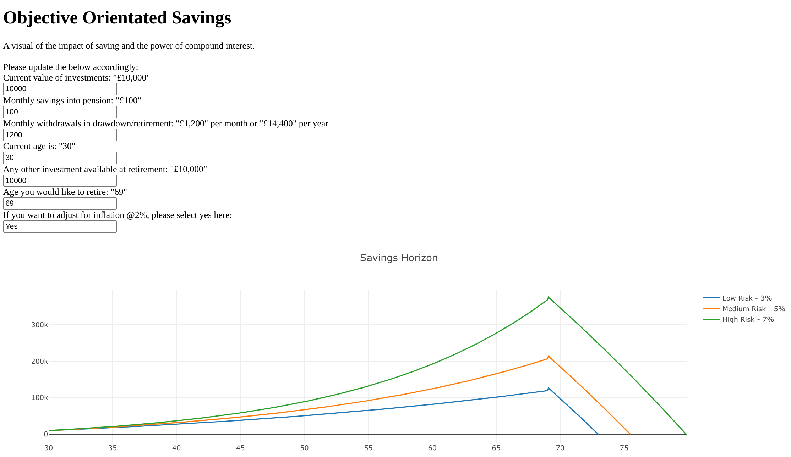

# Objective Orientated Savings

A basic web demo for visualising savings contributions and working backwards from an objective. 
Demonstrating the impact of saving early and the importance of compound interest.

## Installation

Install the necessary dependencies using the below:

```bash
pip install -r requirements.txt
```

Command to run the application:
```bash
python app.py
```

An example of the application is shown below.

